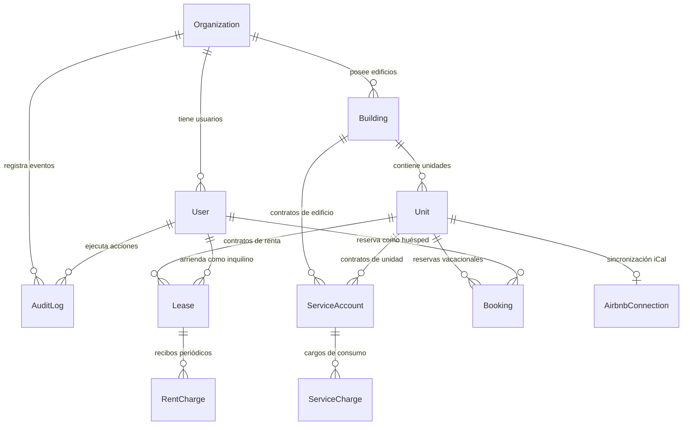

# Arquitectura: Modelo de Datos Relacional (PostgreSQL / Prisma)

> **Archivo Fuente del Esquema**: [`prisma/schema.prisma`](file:///c:/Users/xenon/Desktop/CARCAR/prisma/schema.prisma)  
> **Motor de Base de Datos**: PostgreSQL 16/17 (Neon Serverless en la nube o contenedor Docker local/VPS)  

---

## 1. Diagrama Entidad-Relación (ER)

---

## 2. Entidades Principales del Sistema

### A. Organización y Multi-Tenancy (`Organization`)
Representa al arrendador o empresa cliente (ej. CARCAR). Es el ancla de aislamiento multi-tenant.
- **Campos Clave**: `id`, `name`, `brandName`, `logoUrl`, `primaryColor`, `radius`, `fontFamily`, `plan` (`FREE` | `PREMIUM`).
- **Personalización de Marca**: Los tokens visuales (`primaryColor`, tipografía) visten automáticamente la interfaz para el personal y los inquilinos.

### B. Usuarios y Control de Acceso (`User`)
- **Roles**:
  - `OWNER`: Arrendador o dueño patrimonial con acceso total administrativo y de marca.
  - `ADMIN`: Personal operativo gestor de propiedades, cobros, contratos y servicios.
  - `VIEWER`: Auditor o socio con permisos de solo lectura (calendario y KPIs).
  - `TENANT`: Inquilino tradicional o huésped con acceso restringido a su portal.
- **Seguridad**: Autenticación stateless mediante JWT (`jose`) y hashing de contraseñas.

### C. Propiedades e Inventario (`Building` y `Unit`)
- **Edificios (`Building`)**: Agrupación física o jurídica de departamentos, casas o locales comerciales.
- **Unidades (`Unit`)**: Cada espacio arrendable independiente.
  - **Moneda (`Currency`)**: `MXN` para rentas tradicionales locales o `USD` para inventario turístico/vacacional.
  - **Tipología (`UnitType`)**: `ROOM`, `APARTMENT`, `STUDIO`, `COMMERCIAL`.
  - **Esquema de Precios**: Soporta `baseRent` (renta mensual fija) y tarifas de corta estancia (`nightlyPrice`, `weeklyPrice`).

### D. Contratos Tradicionales y Recibos (`Lease` y `RentCharge`)
- **`Lease`**: Contrato firmado con fecha de inicio, fin, día de pago mensual y depósito en garantía.
- **`RentCharge`**: Recibo mensual emitido para cada periodo (`YYYY-MM`). Controla monto, estatus (`PENDING`, `PAID`, `OVERDUE`), fecha de pago y referencia o URL del comprobante.

### E. Reservas de Corta Estancia (`Booking` y `AirbnbConnection`)
- **`Booking`**: Estadías cortas con `checkIn`, `checkOut`, número de huéspedes y monto total.
- **`AirbnbConnection`**: Integración bidireccional mediante enlaces de sincronización de calendario iCal.

### F. Servicios y Prorrateos (`ServiceAccount` y `ServiceCharge`)
- **`ServiceType`**: `WATER`, `ELECTRICITY`, `INTERNET`, `MAINTENANCE`, `GAS`, `OTHER`.
- **`ServiceScope`**: Ámbito a nivel `BUILDING` (recibo global de luz/agua de todo el complejo) o `UNIT` (medidor individual).
- **`SplitMode`**: Modalidad de prorrateo automático:
  - `NONE`: No se divide.
  - `EQUAL`: Partes iguales entre unidades activas.
  - `BY_SIZE`: Proporcional al área en metros cuadrados (`sizeM2`).

### G. Auditoría y Trazabilidad (`AuditLog`)
Registra cada mutación crítica del sistema vinculada al usuario y organización correspondiente: `action`, `entity`, `entityId`, `detail`, `createdAt`.
