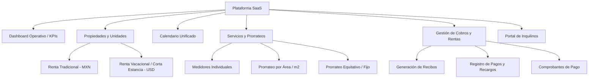

# Modelo de Negocio SaaS, Tiers Comerciales y Acuerdo de Sociedad

> **Documento Original**: [`Resumen_Propuesta_Plataforma_para_Informatico (1).docx`](file:///c:/Users/xenon/Desktop/CARCAR/docs/negocio/Resumen_Propuesta_Plataforma_para_Informatico%20(1).docx)  
> **Fecha**: Septiembre 2026  
> **Ámbito**: Estrategia de producto, comercialización y acuerdo societario  

---

## 1. Tesis Central del Producto

1. **Cliente Piloto vs Producto General**:  
   CARCAR es nuestro primer cliente real y banco de pruebas de validación operativa. Sin embargo, la plataforma está diseñada desde sus cimientos como un **SaaS B2B Multi-Tenant replicable** para administradores de propiedades, propietarios patrimoniales y operadores de rentas tradicionales y vacacionales.
2. **Escalabilidad por Recurrencia**:  
   El modelo de negocio se basa en vender una **misma base tecnológica a múltiples clientes** mediante suscripciones mensuales recurrentes, eliminando el desarrollo de software a medida para cada empresa y logrando márgenes operativos crecientes.

---

## 2. Estructura de Módulos de la Plataforma



### Módulos Base (v1.0)
- **Dashboard / Inicio**: Indicadores clave de ocupación, ingresos del mes, rentas vencidas y alertas de servicios.
- **Propiedades y Unidades**: Gestión jerárquica de Edificios / Complejos y Unidades habitacionales o comerciales con asignación de moneda (`MXN` o `USD`).
- **Calendario Unificado**: Visualización de contratos a largo plazo y reservas de corta estancia (bloqueos, fechas de entrada/salida).
- **Servicios y Prorrateos**: Alta de contratos de servicios (CFE, Aguakan, Internet, Gas), carga de consumos y cálculo automático de prorrateos por m2 o partes iguales.
- **Cobros y Recibos**: Emisión automática de estados de cuenta, control de morosidad, recargos por mora y registro de comprobantes de pago.
- **Portal del Inquilino**: Espacio de autoservicio para consultar contratos vigentes, recibos pendientes, desglose de servicios y registro de comprobantes.

### Roadmap Futuro (v1.x y v2.0)
- Módulo de reportes contables y fiscales avanzados (descarga a Excel/PDF).
- Automatizaciones de mensajería (recordatorios automáticos por WhatsApp y correo electrónico).
- Generación digital de contratos y firma electrónica.
- Control granular de permisos por usuario y sucursales.

---

## 3. Estructura Comercial y Planes de Suscripción

El cobro a clientes se determina por el **número de unidades activas bajo administración**, independientemente de cómo estén distribuidas entre edificios o casas independientes.

| Plan | Unidades Incluidas | Precio Mensual (MXN) | Perfil de Cliente Objetivo |
|---|:---:|:---:|---|
| **Essential** | Hasta 10 unidades | **$890** | Propietario independiente o administrador principiante |
| **Growth** | Hasta 30 unidades | **$1,590** | Operador inmobiliario en fase de expansión |
| **Pro** | Hasta 75 unidades | **$2,790** | Empresa de administración profesional de rentas |
| **Business** | 76 o más unidades | **Desde $3,990** | Portafolios corporativos, administradoras medianas y grandes |

### Políticas Comerciales Generales
- **Periodo de prueba**: 14 días de prueba gratuita sin compromiso.
- **Cero planes gratuitos permanentes**: Todo usuario activo representa consumo de infraestructura y soporte.
- **Incentivo de pago anual**: 10 meses pagados = 12 meses de servicio activo (2 meses de descuento).
- **Tarifa a CARCAR (Cliente Fundador)**: Tarifa preferencial de **$2,500 MXN/mes** (fija durante 12 meses) por sus 121 unidades (las cuales normalmente caerían en el plan *Business* de $3,990+ MXN).

---

## 4. Estructura de Participación entre Socios

La plataforma se construye y opera como una alianza estratégica entre dos áreas indispensables:

```
                      +------------------------------------------+
                      |         PLATAFORMA SAAS (RentaCore)      |
                      +--------------------+---------------------+
                                           |
                  +------------------------+------------------------+
                  |                                                 |
         [ Área Comercial / UX ]                           [ Área Tecnológica ]
         - Iza (55% o 50%)                                 - Socio Técnico (45% o 50%)
         - Arquitectura funcional                          - Arquitectura de software
         - Definición de producto                          - Código, base de datos y APIs
         - Experiencia de usuario (UX)                     - Infraestructura, Docker y VPS
         - Ventas, prospección y demos                     - Seguridad, hardening y backups
         - Relación con clientes y soporte                 - Corrección de bugs y evolución
```

### Distribución de Utilidades
- La utilidad distribuible se calcula deduciendo primero todos los **costos tecnológicos directos** (servidores VPS, bases de datos en la nube, dominios, pasarelas de pago, servicios transaccionales).
- **Esquema de partida**: 55% para Iza y 45% para el socio técnico.
- **Esquema alternativo paritario**: 50% / 50% siempre que ambas partes asuman de forma continua y equivalente responsabilidades operativas en el negocio.

---

## 5. Acuerdos Clave Previos al Lanzamiento Comercial

Antes de abrir ventas masivas a terceros, deben formalizarse los siguientes puntos:
1. **Propiedad Intelectual y Marca**: Registro formal de la marca comercial independiente del SaaS y titularidad compartida del repositorio de código.
2. **Presupuesto y Administración de Infraestructura**: Cuenta bancaria o tarjeta corporativa asignada al pago de servidores (Hetzner/Oracle), dominios, Cloudflare y Neon.
3. **Nivel de Servicio (SLA) y Soporte**: Horarios y responsabilidades de atención a incidencias técnicas vs atención a usuarios finales.
4. **Acuerdo de Salida (Buyout / Vesting)**: Reglas claras sobre valuación del software y derechos económicos en caso de retiro voluntario de uno de los socios.
5. **Regla de Oro de Desarrollo**: Toda mejora que sea de beneficio general forma parte del roadmap del SaaS. Si un cliente solicita una adaptación privada o específica, se cotiza como servicio profesional adicional.
